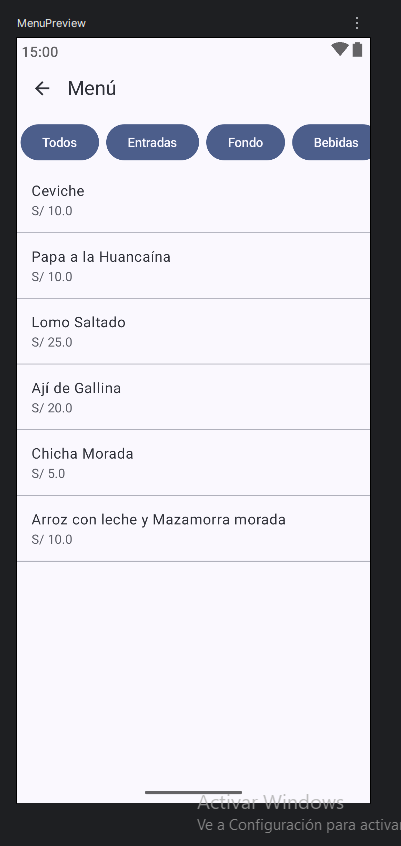
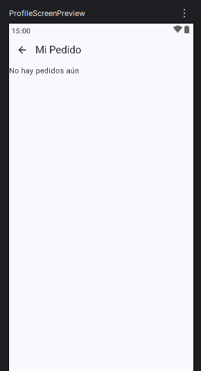
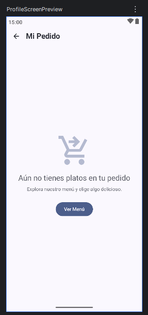

# Mejoras con Gemini — Sabor Andino

---

## Mejora 1: Rediseño en el Menú,Perfl y Login

### Prompt usado:
Actúa como un diseñador senior especializado en UI para aplicaciones 
móviles Android con Jetpack Compose, analiza mi aplicación y 
ayúdame a mejorar en:
- Jerarquía visual (tamaños, texto)
- Espaciado y alineación
- Uso de colores
- Componentes visuales (cards, botones, top bar)
  IMPORTANTE:
- No cambies la lógica de negocio
- Propón mejoras realistas para un estudiante
Objetivo: mejorar la apariencia y usabilidad sin romper la funcionalidad.

### Sugerencia:
"Para un menú de restaurante, la imagen es la protagonista. Sugiero reemplazar la lista plana 
por `ElevatedCard` con bordes redondeados (16dp) y usar `FilterChip` para las categorías. Esto
mejora la 'escaneabilidad' y la estética general."

### Antes:

### Después:

### Implementación:
Se implementó `PlatoCard` usando `ElevatedCard` y `ContentScale.Crop` para las imágenes. Se reemplazaron los botones de categoría por `FilterChip`.

### Antes:

### Despues:

### Reflexión:
La sugerencia fue fundamental. La app pasó de parecer un prototipo de
texto a una aplicación comercial real donde el producto
(la comida) destaca.

---

## Mejora 2: Incorporación de Imagenes en el Menú

### Prompt usado:
Chat para el apartado de Menu me gustaria agregar imagenes, 
sugiereme de que forma deberia implementarlo y guiame paso a paso
### Sugerencia:
"Un estado vacío no debe ser solo una pantalla en blanco. Agrega una validación visual que informe al usuario que su carrito está vacío y proporciónale una estructura clara de totales cuando tenga productos."

### Antes:
No había validación clara o el diseño era inconsistente cuando la lista estaba vacía.

### Después:
Validación con mensaje centralizado en `ProfileScreen` y una lista organizada con cálculo de total automático.

### Implementación:
Se agregó un condicional `if (pedido.isEmpty())` en `ProfileScreen.kt` y se usó `PedidoManager` para centralizar la lógica del total.

### Reflexión:
Mejorar los estados vacíos da una sensación de robustez a la aplicación. El usuario ahora entiende perfectamente qué está pasando en su carrito.

---

## Mejora 3: Ergonomía y Jerarquía en Detalle del Plato

### Prompt usado:
(Igual al anterior, enfocado en componentes visuales y experiencia de usuario).

### Sugerencia:
"Resalta el precio usando contenedores tonales y agrupa los controles
de cantidad con el botón de compra en la parte inferior para 
mejorar la ergonomía al usar el teléfono con una mano."

### Antes:
Botones dispersos y precio sin énfasis visual.

### Después:
Imagen de cabecera 'Hero', precio resaltado en un `Surface` secundario y barra de acciones inferior agrupada.

### Implementación:
Uso de `Scaffold` con una barra de acciones inferior personalizada en `DetailScreen.kt` y estilos de tipografía `Headline` para el nombre del plato.

### Reflexión:
Esta mejora cambió la forma en que el usuario interactúa con la pantalla de detalle, haciendo el proceso de 'Agregar' mucho más rápido e intuitivo.
